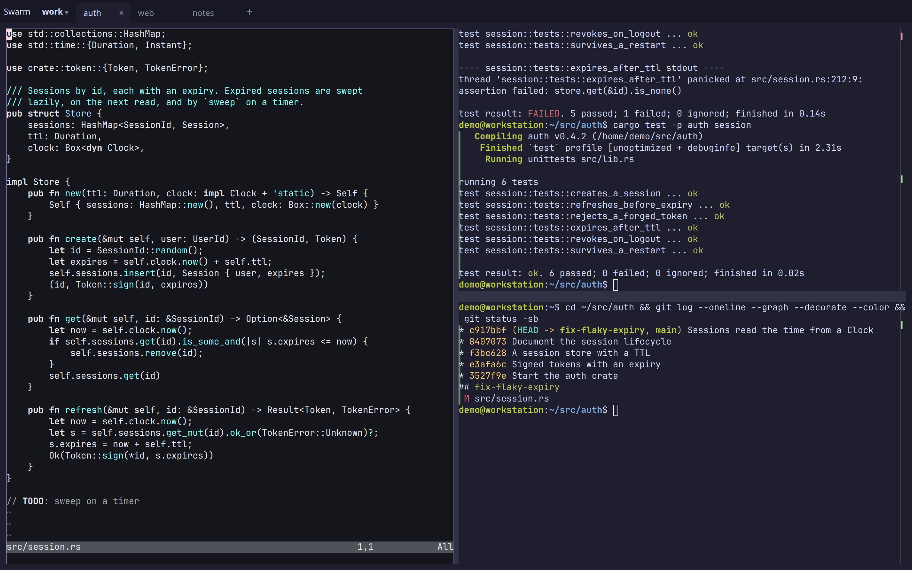
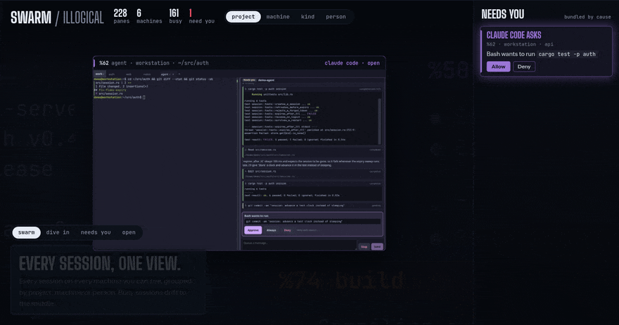

# illogical

Keep track of your agents without checking every session. See which agents
need input and what your teammates are working on. Leave unfinished work
open, come back later, or join a teammate's session to help.

illogical is a terminal multiplexer whose sessions outlive the window, the
daemon and the reboot. A daemon owns your terminals; the browser (desktop or
phone) draws tabs and splits you drive with the mouse.



- **The swarm.** Every pane on every machine you and your team can see, in
  one live view, clustered by project, machine, kind or person. Whatever
  needs someone (an agent asking, a build failing) lifts out to a rail of
  cards, where anyone on the team who may answer allows, answers or sends
  the agent its next instruction, and everyone sees who did.
- **Agents as blocks.** Claude Code, Codex or any
  [ACP](https://agentclientprotocol.com) agent as a UI beside your
  terminals: tool calls with their output, approvals and questions as
  cards big enough for a thumb.
- **Mouse first.** Click, drag and right-click for tabs and splits. No
  chords to learn, no prefix key.
- **Durable.** Close the window, lose the connection, restart the daemon or
  reboot: the layout, working directories and scrollback come back, and
  each pane does what you told it to (a shell where it was, re-run its
  command, `claude --continue`). On Linux a daemon restart doesn't even
  touch running programs.
- **Anywhere on your tailnet.** The same live layout on every window and
  your phone, over [Tailscale](https://tailscale.com). Push notifications
  when a pane rings, a long command finishes, or an agent needs you.
- **VS Code and dev servers beside your terminals** (opt-in). *Open in
  editor* (or `illogical edit src/main.rs:42`) opens VS Code on the pane's
  machine, in its directory, as a block, back with its file after a
  restart; *Open a port…* shows a dev server beside its terminal. Both are
  off until the daemon gets a listener for them (one flag for this
  computer's browser; a domain of yours for the phone): see
  [advanced setup](docs/advanced.md#browser-blocks-on-ports).
- **What did the agent change?** *Changes* on a pane (or `illogical diff`)
  lists the files changed in its repository, on its machine, with +/−; tap
  a file for its hunks and a line to see the file there, both updating
  while the agent works. Phone first, and a failed build is a *Rerun* tap
  away.
- **Your editor in the swarm.** VS Code, Cursor or nvim (over Remote-SSH
  too) shows up beside your panes once you ask it to. Follow its cursor
  from your phone; a debugger stopping, or Claude Code wanting to edit a
  file, is a card you answer from anywhere.
- **Scriptable.** `illogical`, a CLI for scripts and agents: run, send,
  wait for a command or a match, tail, search every pane's history.
- **In any terminal, too.** `illogical tui` draws the same tabs and splits
  in the terminal you're in (over ssh as well), with a sidebar of what
  needs you: allow an agent's request from there without opening its pane.
  Select, search a pane's whole history and copy, to your own clipboard
  over ssh.

[](https://illogical.widgets.wtf)

Linux (x86_64, arm64), macOS (Apple silicon and Intel) and Windows 10 and 11
(x86_64). Share a session with
someone, or a whole machine with a team, with roles and presence
([docs/teams.md](docs/teams.md)). Remote access is over your tailnet, or
through [illogical control](docs/control.md) for devices without one: end
to end encrypted, so what the service relays it can't read, and it can't
add a reader to your machines. You do trust it for the web client it
serves ([what holds](docs/control-e2e.md#what-holds-against-control)).

## Install

**The desktop app** (macOS 13 or later on Apple silicon or Intel, Linux
x86_64, Windows 10 or 11 x86_64), from
[illogical.widgets.wtf](https://illogical.widgets.wtf) or the
[newest app release](https://github.com/arugula-salad/illogical/releases/tag/app-latest):
`illogical-desktop-macos-arm64.zip` (Apple silicon),
`illogical-desktop-macos-x86_64.zip` (Intel),
`illogical-desktop-linux-x86_64.AppImage` or `.deb` (the Linux app runs on
Ubuntu 22.04, Debian 12, Fedora 36 or newer: glibc 2.35 and up),
`illogical-desktop-windows-x86_64-setup.exe`. The first time it opens it
installs `illogicald` and `illogical` (in `~/.local/bin`, or
`%LOCALAPPDATA%\Programs\illogical` on Windows) and starts the daemon as a
service, then *Getting started*
sets up your phone, the cloud and Claude Code, a click each. Once the
machine is in illogical cloud, the app signs in through your browser on
the same computer (approve it as a new device once) and shows every machine in your account
and your teams. The macOS app
isn't notarized yet: the first time, open it, then choose *Open Anyway* in
System Settings › Privacy & Security.
Or, in Terminal, install.sh (below) installs the Mac app too, with no
*Open Anyway* step (`curl` leaves no quarantine flag), in `/Applications`
if you can write there and `~/Applications` if not, and opens it.

The Windows installer isn't signed yet: when SmartScreen stops it, choose
*More info*, then *Run anyway*.

**Servers and machines without a screen:**

```
curl -fsSL https://illogical.widgets.wtf/install.sh | sh
```

This puts `illogicald` and `illogical` in `~/.local/bin` and starts the
daemon as a service (systemd user unit on Linux, launchd agent on macOS).
On a Mac with someone at its screen it installs the desktop app too, from
the newest app release; the app uses the daemon install.sh set up.
`sh -s -- --no-app` leaves the app out; over ssh it's left out unless you
add `--app`.
Run it again to upgrade. `ILLOGICAL_VERSION=vX.Y.Z` picks a version.
`ILLOGICAL_APP_VERSION=app-vX.Y.Z` picks the app's.

On Windows, in PowerShell:

```
irm https://illogical.widgets.wtf/install.ps1 | iex
```

This puts them in `%LOCALAPPDATA%\Programs\illogical` (on your `PATH`) and
starts the daemon at logon, as a scheduled task. `$env:ILLOGICAL_VERSION`
picks a version.

**Homebrew** (macOS, Linux):

```
brew tap arugula-salad/tap
brew install illogical
illogicald install
```

**From source:** see [docs/development.md](docs/development.md#build-from-source).

On Linux, let it start at boot, before you log in:

```
loginctl enable-linger $USER
```

**Updating.** When a newer release is out, the top bar says so, with the
command for how you installed it. Panes keep running while the daemon
restarts.

- install.sh or install.ps1: run it again (on a Mac at its screen, that updates the app too).
- Homebrew: `brew upgrade illogical && illogicald install`.
- The desktop app: download the new one and open it. When it finds an
  older daemon running as the service, it puts its own in its place,
  keeping the daemon's flags and your panes.

The daemon finds out by asking GitHub where its latest release is, at
most twice a day; nothing else is sent. `illogicald install --
--no-update-check` turns that off.

## Quickstart

1. Run `illogical web`: it opens <http://127.0.0.1:7681> in your browser,
   signed in (programs on this machine show its local token; see
   [docs/advanced.md](docs/advanced.md)). Over ssh it prints the link
   and the `ssh -L` that forwards the port to the computer you're at.
   Right-click a pane or a tab for
   everything. Drag a tab or a pane onto another pane's edge to split it
   there; drag dividers to resize.
2. **From your phone and other machines**, put it behind Tailscale on this
   machine. The first time:
   - turn on **MagicDNS** and **HTTPS certificates** in the tailnet's
     [DNS settings](https://login.tailscale.com/admin/dns), or `serve`
     fails;
   - on Linux, let yourself run `serve` without sudo: `sudo tailscale set
     --operator=$USER`;
   - on macOS, the app's CLI may not be on your PATH: it's
     `/Applications/Tailscale.app/Contents/MacOS/Tailscale`.

   Then:

   ```
   tailscale serve --bg --https=443 http://127.0.0.1:7681
   ```

   and open `https://<this machine>.<tailnet>.ts.net`: `tailscale serve
   status` prints it, and so does *Getting started* in the session menu
   (and `install.sh`, when Tailscale is up). Only the Tailscale
   login that owns the machine gets in (`illogicald install -- --owner
   you@example.com` for someone else). On the phone, add it to the home
   screen, then *Notify this device* in the menu (☰).
3. **From a script or another pane:**

   ```
   illogical run --wait -- cargo build        # a new tab; exits with its exit code
   illogical send %3 'git status' -e          # type a line and press Enter
   illogical wait %3 --match 'listening on'
   illogical tail %3 -f --text
   illogical search 'panic|Traceback' --since 1d
   ```

   [docs/cli.md](docs/cli.md) has the rest.
4. **In a terminal**, or over ssh: `illogical tui`. The mouse works as in
   the browser; Ctrl-] is the menu key (Ctrl-] ? lists the rest).
5. **Without a tailnet**, add the machine to an account on illogical
   control and use it from any browser:

   ```
   illogicald join https://control.illogical.widgets.wtf
   ```

   The hosted control is free during the beta, provided as is. See
   [docs/control.md](docs/control.md), including running your own.
   **With a team:** make one in control (*Teams…*), invite people, and
   pick the team when you approve a machine's join. Roles, personal vs
   team machines and sharing one session: [docs/teams.md](docs/teams.md).
6. **Agents.** *Start an agent…* in a pane's menu, or `illogical agent
   "fix the failing test"`. Claude Code and Codex run through an npm
   adapter (needs Node 20+). `illogical setup claude`, or *Use Claude Code
   with illogical* in Getting started's Agents step, installs Claude
   Code's and adds illogical's MCP server (step 7) in one go; *Start an
   agent…* offers to install it too, in a pane you can watch. Or install
   it yourself:

   ```
   npm install --prefix ~/.local/share/illogical/agents/claude @agentclientprotocol/claude-agent-acp@0.85.0
   npm install --omit=optional --prefix ~/.local/share/illogical/agents/codex @agentclientprotocol/codex-acp@2.1.0
   ```

   Claude Code in an ordinary pane can raise the same notifications,
   question cards and permission cards, and take follow-ups, through its
   hooks: see [Claude Code in a pane](docs/cli.md#claude-code-in-a-pane).
7. **As tools for any agent (MCP).** Give Claude Code (or Codex, or any
   MCP client) illogical's tools: it runs builds and dev servers in panes
   you can watch from the phone and take over, waits on them, starts and
   answers other agents, and searches what happened yesterday.

   ```
   claude mcp add illogical -- illogical mcp
   ```

   The read-only tools are safe to allow outright; leave the rest to ask.
   In `~/.claude/settings.json` (or the project's `.claude/settings.json`):

   ```json
   {
     "permissions": {
       "allow": [
         "mcp__illogical__read_output", "mcp__illogical__wait", "mcp__illogical__list",
         "mcp__illogical__history", "mcp__illogical__read_forge", "mcp__illogical__read_invite",
         "mcp__illogical__read_file"
       ],
       "ask": [
         "mcp__illogical__run", "mcp__illogical__send_input", "mcp__illogical__attach", "mcp__illogical__close",
         "mcp__illogical__show", "mcp__illogical__start_agent", "mcp__illogical__prompt_agent",
         "mcp__illogical__agent_respond", "mcp__illogical__draft", "mcp__illogical__invite_person",
         "mcp__illogical__device_call"
       ]
     }
   }
   ```

   `invite_person` is safe to move to `allow`: it only drafts. The card
   it raises beside the agent, which only the session's owner can send,
   is the real gate.

   What it starts says "started by mcp:claude-code". Agent blocks get the
   same tools by themselves, limited to their own tab. Over HTTP, tokens,
   and the tools: [MCP](docs/cli.md#mcp).

## On macOS

Everything above works, except that restarting or upgrading the daemon
ends the panes' programs (there's no systemd to hold them); scrollback and
layout still come back.

## On Windows

Panes run PowerShell (PowerShell 7 if it's installed, else Windows
PowerShell), with prompts, commands, exit codes and the directory reported
as in bash, zsh and fish: illogical passes its integration inline, so no
profile or execution policy change is needed. Each pane has a small host
process of its own, so panes keep running while the daemon restarts or
upgrades, as on Linux.

The daemon starts when you log on, and logging off ends it; its panes close
a minute later. `illogicald install --system` (from an elevated terminal)
starts it at boot instead, but programs there can't use Windows' protected
storage, so Credential Manager and Git Credential Manager don't work in its
panes. `illogical --ssh` doesn't reach Windows yet.

## More

- [docs/features.md](docs/features.md): everything it does, in detail.
- [docs/advanced.md](docs/advanced.md): web apps beside their terminals,
  more machines and containers, iTerm2 as a tmux client.
- [docs/teams.md](docs/teams.md): your machines, your team: roles,
  personal vs team machines, sharing a session.
- [docs/control.md](docs/control.md): illogical control, hosted or your
  own; [docs/control-e2e.md](docs/control-e2e.md), how it keeps out of your
  terminals.
- [docs/cli.md](docs/cli.md): the CLI and the HTTP API.
- [docs/development.md](docs/development.md): building, testing, the code's
  layout, and what building it taught us.
- [DECISIONS.md](DECISIONS.md): the decisions that still hold.
- [docs/plan-archive.md](docs/plan-archive.md): the original plan and every milestone.

## License

MIT OR Apache-2.0, at your option. Terminal emulation by
[libghostty](https://ghostty.org); see [THIRD_PARTY.md](THIRD_PARTY.md).
